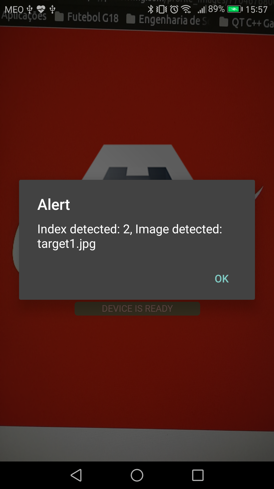

# Image Detection Cordova Plugin Demo

[](http://unmaintained.tech/)

This demo was done to show an example on the usage of the [ImageDetectionCordovaPlugin](https://github.com/Cloudoki/ImageDetectionCordovaPlugin). The code shown can serve has a guide but this project won't receive any updates in the future.

----

This is a demo App that already includes the plugin.

You can find the plugin [here](https://github.com/Cloudoki/ImageDetectionCordovaPlugin).

## Running

Add the desired platform and run it.

Before running the commands bellow go into `plugins/com.cloudoki.imagedetectionplugin/src/ios/` and extract the `opencv2.framework.zip` since it's too big for Github.

## Android

```
$ cordova platform add android
$ cordova run android
```

## iOS

```
 $ cordova platform add ios
 $ cordova run ios
```

Point the camera to one of the following targets images or any other that might contain the target:

- [Coca-cola **(target 1)**](https://pbs.twimg.com/profile_images/770467680012890112/kSz1jtnn.jpg)
- [Homer Simpson **(target 2)**](http://cdn2.thr.com/sites/default/files/2016/02/simp2006_homerarmscrossed_f_hires2_-_h_2016.jpg)
- [OpenCV **(target 3)**](http://www.pyimagesearch.com/wp-content/uploads/2015/01/url_to_image_opencv.jpg)

An alert saying the target's name should apper when the target is detected.


